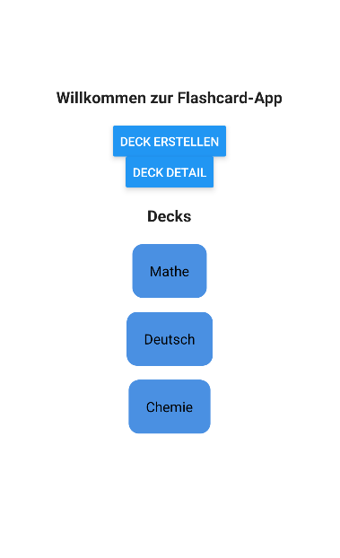

# Tag 01 – Flashcard App

## Erklärungen

### Was wurde gemacht?

Am ersten Tag wurde die Grundstruktur der Flashcard-App mit **Expo React Native** und **TypeScript** aufgebaut.

Folgende Schritte wurden durchgeführt:

- Expo-Projekt erstellt mit npx create-expo-app FlashcardApp
- Projekt mit npm run reset-project zurückgesetzt
- Ordnerstruktur nach Vorgabe angelegt (app/, components/, data/, app/deck/)
- Routing mit **Expo Router** eingerichtet
- _layout.tsx als globales Layout erstellt
- index.tsx als Startseite mit Titel und zwei Navigations-Buttons erstellt
- create.tsx als Seite zum Erstellen von Decks angelegt
- app/deck/[deckId].tsx als dynamische Deck-Detail-Seite angelegt
- Drei statische Deck-Ansichten auf der Startseite erstellt

### Was war neu?

Für mich war alles neu, da ich noch nie mit den Applikationen und Programmiersprachen gearbeitet habe.
Es gibt zwar verbindungen zu Java, jedoch ist fällt es mich schwer diese anzuwenden.

---

## Reflexion / Herausforderungen

### Was lief gut?

Die Grundstruktur war schnell aufgebaut. Das dateibasierte Routing von Expo Router ist intuitiv, sobald man versteht, dass jede Datei in app/ automatisch eine Route ist, macht die Navigation sehr viel Sinn.

Das Styling fühlte sich vertraut an, da die Eigenschaften stark an CSS erinnern (z. B. backgroundColor, borderRadius, padding).

### Was war herausfordernd?

- **npm run reset-project schlug fehl**, weil der Terminal im falschen Verzeichnis war. Lösung: ins richtige Verzeichnis mit cd wechseln.
- **React Native Styling** war anfangs ungewohnt, da kein klassisches CSS verwendet wird, sondern JavaScript-Objekte mit camelCase-Eigenschaften.

## Zwischenergebnis

