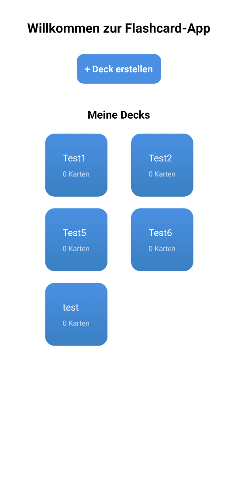
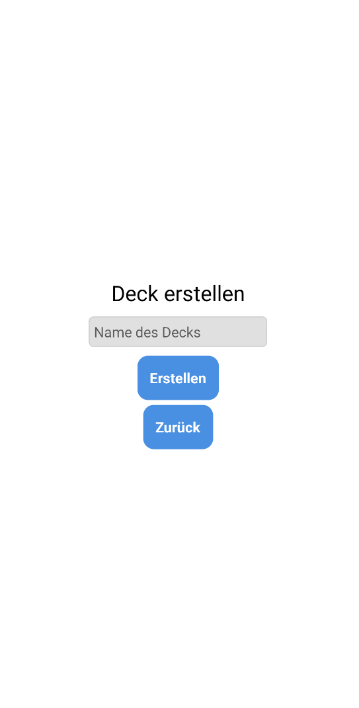
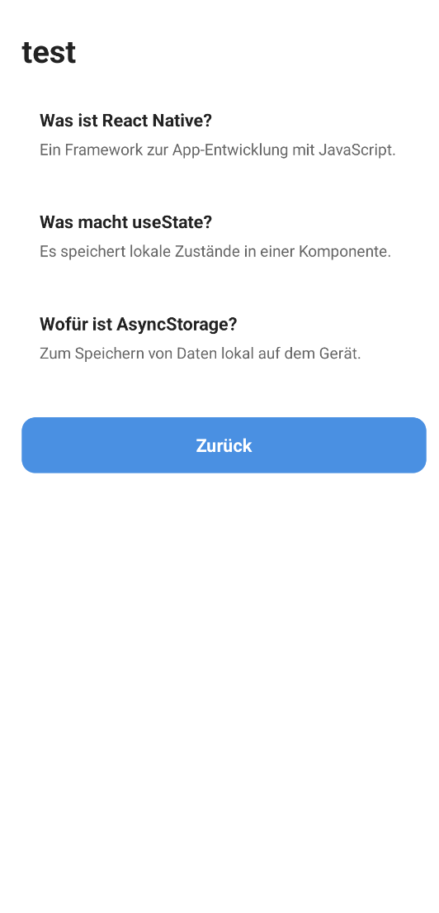
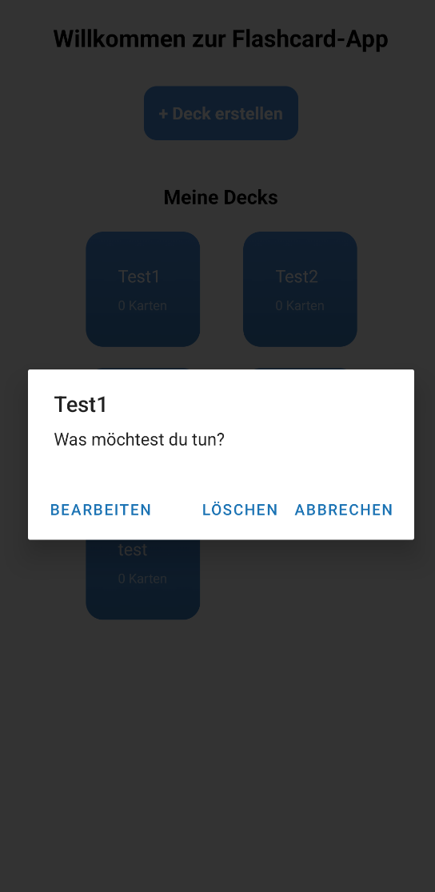

# Tag 03 – Flashcard App

## Erklärungen

### Was wurde gemacht?

Am dritten Tag wurde die App verschönert und der Code sauberer strukturiert. Die App sieht jetzt professioneller aus und zeigt die gespeicherten Karten auch auf der Detailseite an.

Folgende Schritte wurden durchgeführt:

- Alle Styles aus index.tsx und [deckId].tsx in eine separate Datei styles.ts ausgelagert
- Die Startseite auf ein zweispaltiges Grid-Layout umgestellt (numColumns={2} in FlatList)
- Farbverläufe (LinearGradient) für die Deck-Karten eingebaut
- Den normalen Button durch TouchableOpacity + Text ersetzt, um ihn frei stylen zu können
- Ein LongPress-Menü auf den Deck-Karten eingebaut (Alert.alert mit mehreren Optionen)
- Auf der Detailseite einen Ladeindikator (ActivityIndicator) eingebaut
- Die Detailseite zeigt jetzt alle Cards eines Decks in einer FlatList an
- Den Zurück-Button als ListFooterComponent in die FlatList eingebaut, damit er immer sichtbar ist

### Was war neu?

- **styles.ts**: Eine separate Datei nur für Styles. So bleibt der Code in den Screen-Dateien übersichtlich. Die Styles werden mit export default exportiert und in anderen Dateien mit import styles from './styles' eingebunden.

- **numColumns={2}**: Eine einzige Prop in der FlatList, die aus einer normalen Liste ein zweispaltiges Grid macht.

- **LinearGradient**: Komponente aus dem Paket expo-linear-gradient. Ersetzt ein normales View und zeigt einen Farbverlauf als Hintergrund an. Man gibt ihr ein Array mit zwei Farben: colors={[farbe1, farbe2]}.

- **TouchableOpacity**: Ersatz für den normalen Button. Kann komplett frei gestylt werden, weil es einfach ein anklickbares View ist. Der sichtbare Inhalt (z. B. Text) kommt als Kind-Element rein.

- **onLongPress**: Eine Prop auf TouchableOpacity, die beim langen Drücken ausgeführt wird, genau wie onPress, aber für langes Halten.

- **ActivityIndicator**: Eine eingebaute React Native Komponente, die einen Ladekreis anzeigt. Wird angezeigt, solange die Daten noch geladen werden.

- **ListFooterComponent**: Eine Prop der FlatList. Damit kann man ein Element ans Ende der Liste hängen, das mitscrollt, zum Beispiel einen Zurück-Button.

- **Drei Return-Fälle**: Eine saubere Methode um verschiedene Zustände anzuzeigen, erst prüfen ob geladen wird, dann ob Daten vorhanden sind, dann den normalen Screen anzeigen.

---

## Reflexion / Herausforderungen

### Was lief gut?

Das Auslagern der Styles in styles.ts war einfach und hat den Code sofort übersichtlicher gemacht. Das Grid-Layout mit numColumns={2} war überraschend einfach, nur eine Zeile Code.

Die Konzepte von Tag 2 wie useState, useEffect und FlatList waren bereits bekannt, was es einfacher gemacht hat, die Detailseite zu erweitern.

### Was war herausfordernd?

- **LinearGradient statt View**: Am Anfang war nicht ganz klar, dass LinearGradient einfach ein View ersetzt und gleich verwendet wird. Sobald das klar war, war es aber einfach einzubauen.

- **Button stylen**: Der normale Button von React Native lässt sich kaum anpassen. Die Lösung ist TouchableOpacity + Text, das gibt volle Kontrolle über das Aussehen.

- **Zurück-Button in der FlatList**: Wenn der Zurück-Button ausserhalb der FlatList steht, kann er bei vielen Karten hinter der Liste versteckt werden. Die Lösung war ListFooterComponent, damit scrollt der Button mit der Liste mit und ist immer sichtbar.

## Zwischenergebnis

