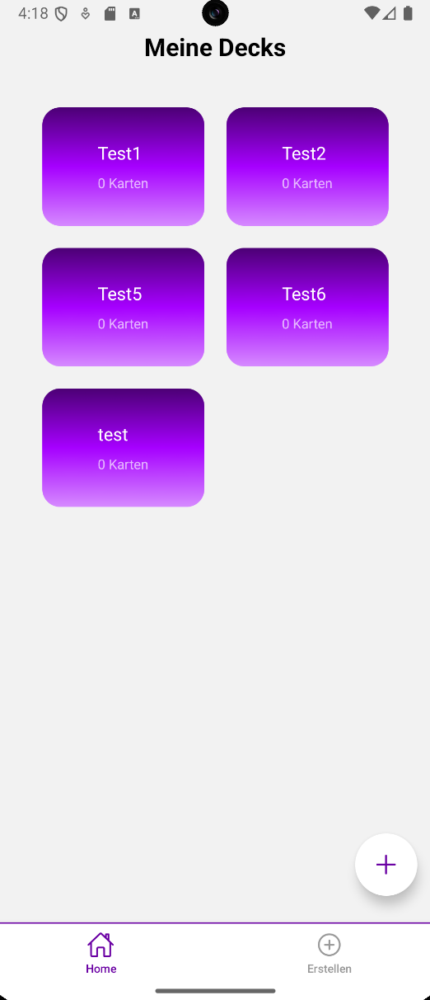
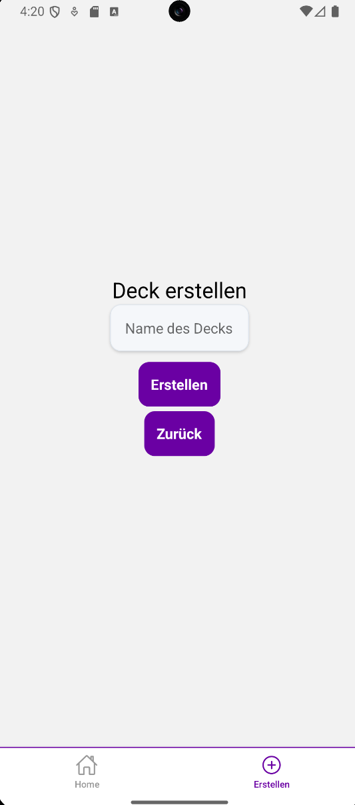
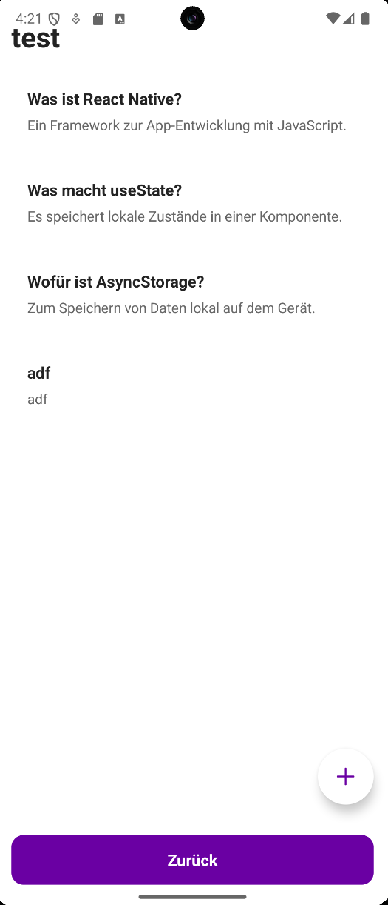
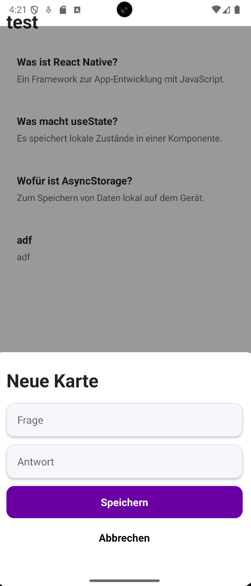

# Tag 04 – Flashcard App

## Erklärungen

### Was wurde gemacht?

Am vierten Tag habe ich die Navigation der App verbessert. Die App hat jetzt eine Bottom Tab Navigation, über die man einfach zwischen den Seiten wechseln kann. Ausserdem wurde ein Floating Action Button (FAB) auf der Startseite eingebaut.

Folgende Schritte wurden durchgeführt:

- Einen neuen Ordner (tabs) im app/-Verzeichnis erstellt
- Die Dateien index.tsx, create.tsx und _layout.tsx in den (tabs)-Ordner verschoben
- Zwei Tabs konfiguriert: „Home" (Startseite) und „Erstellen" (Create-Seite)
- Icons aus @expo/vector-icons für die Tabs eingebaut
- Die Farben der aktiven und inaktiven Tabs angepasst
- Den FAB-Style in styles.ts ergänzt (runder Button, absolut positioniert, unten rechts)
- Einen FAB auf der Startseite eingebaut, der zur Create-Seite navigiert

### Was war neu?

- **(tabs)-Ordner**: Ein spezieller Ordner in Expo Router. Die Klammern ( ) im Namen sagen Expo Router, dass es sich um eine Navigationsgruppe handelt. Die Screens darin teilen sich eine gemeinsame Navigation.

- **_layout.tsx in (tabs)**: Jeder Ordner kann eine eigene _layout.tsx haben. Die eine in (tabs) gilt nur für die Screens in diesem Ordner, also index.tsx und create.tsx. Der [deckId].tsx-Screen liegt ausserhalb und hat keine Tab-Bar.

- **<Tabs>**: Komponente aus expo-router die eine Bottom Tab Navigation erstellt. Mit <Tabs.Screen> kann man jeden Tab einzeln konfigurieren (Titel, Icon).

- **screenOptions**: Prop auf <Tabs> die für alle Tabs gleichzeitig gilt. Damit kann man Farben, Hintergrund und andere Eigenschaften zentral definieren.

- **@expo/vector-icons**: Eine Bibliothek mit tausenden Icons. Mit <Ionicons name="home-outline" size={size} color={color} /> kann man ein Icon anzeigen. Die color und size werden automatisch von Expo übergeben. Aktive Tabs bekommen die aktive Farbe, inaktive die inaktive.

- **FAB (Floating Action Button)**: Ein runder Button der über dem restlichen Inhalt schwebt. Wird mit position: 'absolute', bottom und right positioniert. Die runde Form kommt von borderRadius = halbe Breite/Höhe. elevation gibt ihm einen Schatten auf Android.

---

## Reflexion / Herausforderungen

### Was lief gut?

Die Tab-Navigation war überraschend einfach einzubauen. Expo Router macht das mit wenig Code möglich. Der FAB war auch schnell umgesetzt, da die Styles bereits aus Tag 3 bekannt waren.

### Was war herausfordernd?

- **FAB-Positionierung**: Damit position: 'absolute' funktioniert, muss der äussere Container flex: 1 haben. Ohne das hat der FAB keinen Anker und erscheint nicht am richtigen Ort.

- **Kreis beim FAB**: Die runde Form kommt von borderRadius. Dieser Wert muss genau die Hälfte von width und height sein. Bei width: 56 und height: 56 ist borderRadius: 28 korrekt.

## Zwischenergebnis

