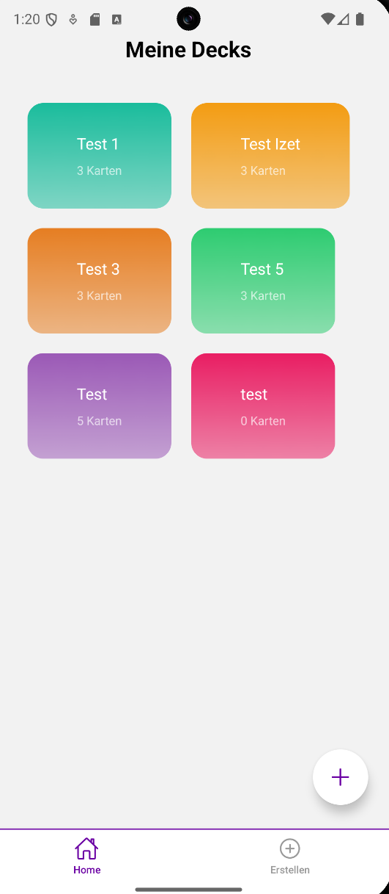
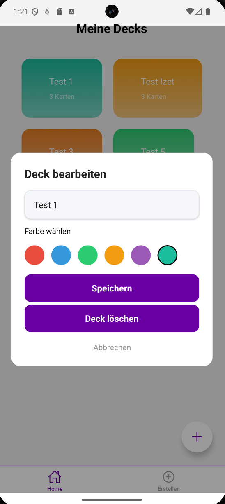
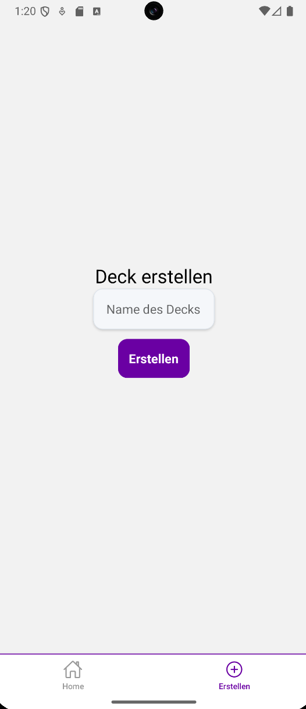
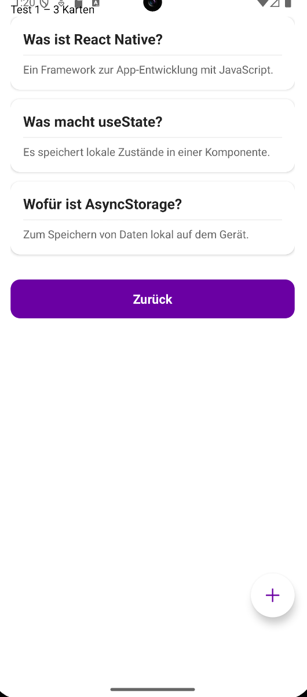
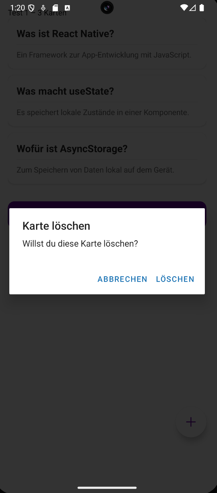

# Tag 06 – Flashcard App

## Erklärungen

### Was wurde gemacht?

Am sechsten Tag habe ich die App um ein Bearbeitungsmenü für Decks erweitert. Beim langen Drücken auf ein Deck öffnet sich jetzt ein Modal, in dem man den Titel ändern, eine neue Farbe auswählen oder das Deck löschen kann. Ausserdem können jetzt auch einzelne Cards per LongPress gelöscht werden.

Folgende Schritte wurden durchgeführt:

- Eine neue Komponente DeckOptionsModal.tsx im components/-Ordner erstellt
- Das Modal zeigt ein Texteingabefeld für den Titel und sechs Farbkreise zur Auswahl
- In index.tsx zwei neue States hinzugefügt: modalVisible und selectedDeck
- Den onLongPress auf Deck-Karten so angepasst, dass das Modal geöffnet wird
- handleSave und handleDelete Funktionen in index.tsx eingebaut
- Das Modal gibt die aktualisierten Daten über Props zurück an index.tsx
- In [deckId].tsx einen LongPress auf Cards eingebaut mit Bestätigungsdialog
- Cards werden per filter() aus dem Deck entfernt und in AsyncStorage aktualisiert
- Neue Styles für Modal, Farbauswahl und Kreise in styles.ts ergänzt
- Das Löschen der Cards habe ich hinzugefügt

### Was war neu?

- **Eigene Komponente mit Props**: DeckOptionsModal ist die erste eigene Komponente mit selbst definierten Props. Props sind Werte die von aussen in eine Komponente hineingegeben werden – ähnlich wie Parameter bei einer Funktion. In TypeScript definiert man sie mit einem type:
tsx
type Props = {
  visible: boolean;
  deck: any;
  onClose: () => void;
  onSave: (updatedDeck: any) => void;
  onDelete: (deckId: string) => void;
};

- **Modal-Komponente**: Eine eingebaute React Native Komponente die Inhalte über dem restlichen Screen anzeigt. Mit transparent wird der Hintergrund durchsichtig, mit animationType="fade" erscheint es weich eingeblendet. visible steuert ob es angezeigt wird oder nicht.

- **Mehrere Styles kombinieren**: Mit einem Array kann man mehrere Styles auf einmal anwenden:
tsx
style={[styles.colorCircle, { backgroundColor: c }, color === c && { borderColor: '#000' }]}

Der erste Style gibt die Form, der zweite die Farbe, der dritte hebt den ausgewählten Kreis hervor.

- **.map() zum Aktualisieren**: Um ein einzelnes Element in einer Liste zu ändern, geht man mit .map() durch alle Elemente und ersetzt nur das passende:
tsx
const updated = decks.map(d => d.id === updatedDeck.id ? updatedDeck : d);

Das bedeutet: für jedes Deck – wenn die ID übereinstimmt, nimm das aktualisierte, sonst behalte das alte.

- **Spread-Operator zum Aktualisieren**: { ...deck, title: neuerTitel, color: neueColor } kopiert alle Eigenschaften des Decks und überschreibt nur die angegebenen. So bleiben z. B. id und cards erhalten.

- **useEffect mit Abhängigkeit**: Der useEffect in DeckOptionsModal hat [deck] als Abhängigkeit. Das bedeutet: jedes Mal wenn sich deck ändert (also ein anderes Deck ausgewählt wird), werden Titel und Farbe neu geladen.

- **Importpfade**: Da styles.ts im app/-Ordner liegt und DeckOptionsModal.tsx im components/-Ordner, muss der Importpfad entsprechend angepasst werden: import styles from '../app/styles'.

---

## Reflexion / Herausforderungen

### Was lief gut?

Das Löschen von Cards war schnell umgesetzt, da das Muster bereits von den Decks bekannt war. Die Struktur von filter() und AsyncStorage aktualisieren war bereits vertraut.

Die Farbkreise mit .map() waren eine elegante Lösung – statt sechs einzelne Buttons zu schreiben, wird die Liste automatisch durchgegangen und für jede Farbe ein Kreis erstellt.

### Was war herausfordernd?

- **Eigene Komponente mit Props**: Das war das erste Mal, dass eine Komponente mit eigenen Props erstellt wurde. Der Unterschied zwischen dem was die Komponente intern verwaltet (State) und was sie von aussen bekommt (Props) war anfangs unklar.

- **Falscher Importpfad**: DeckOptionsModal.tsx lag im components/-Ordner, aber der Import zeigte auf '../styles' was nicht existiert. Die Lösung war den Pfad auf '../app/styles' anzupassen, da styles.ts im app/-Ordner liegt. Langfristig wäre es sauberer, styles.ts im Root-Ordner zu haben.

- **Daten zwischen Komponenten übergeben**: Das Modal ändert Titel und Farbe lokal, aber die eigentliche Speicherung passiert in index.tsx. Dafür werden onSave und onDelete als Props übergeben – Funktionen die von aussen kommen und im Modal aufgerufen werden.

## Zwischenergebnis

